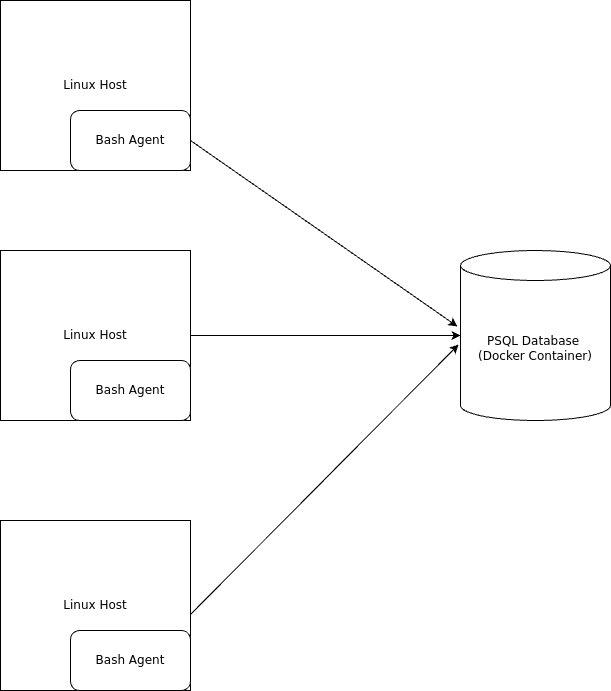

# Introduction

This project provides a minimal viable product that can support the resource planning of a Linux machines cluster with real time data. 
A psql instance is built on a docker container and a database is set up to store the hardware specifications and usage data. 
Shell scripts utilize regex and bash filtering commands to parse and collect data which is inserted into the database. 
A crontab command is used to run the scripts for real time data. 

# Quick Start
- Start a psql instance using psql_docker.sh
```
bash psql_docker.sh start|stop|create db_username db_password
```
- Create tables using ddl.sql
```
bash ddl.sql
```
- Insert hardware specs data into the DB using host_info.sh
```
bash scripts/host_info.sh psql_host psql_port db_name psql_user psql_password
```
- Insert hardware usage data into the DB using host_usage.sh
```
bash scripts/host_usage.sh psql_host psql_port db_name psql_user psql_password
```
- Crontab setup
```
bash crontab -e 
***** bash /host_usage_filepath psql_host psql_port db_name psql_user psql_password > /tmp/host_usage.log
```
# Implemenation

The project was implemented through a Google Cloud Virtual Machine running Linux Rocky 9. The postgres image is required as the base image for the psql container prior to running implementing locally. 

Step 1: Build a docker container using a postgres image and store a volume to the local OS environment. 

Step 2: Info and usage tables are created in a new database with the usage table using host_id as a foreign key. 

Step 3: Hardware specifications and usage data is collected by piping output from bash commands into filtering commands such as grep (collect records), awk (retrieve fields from records), and xargs (trim whitespace). This data is then inserted into their respective database tables.

Step 4: Crontab automation is set up to run the usage scripts every minute. 

## Architecture



## Scripts

1. psql_docker.sh
```
bash psql_docker.sh start|stop|create db_username db_password
```
Before using the agent, a docker container is provisioned to run a postgres database. This script first checks the status of docker and will start the engine if it's not running.
It assumes the postgres image has already been pulled. 
This script can be used with the following

#### Commands 
- create: Checks if the container already exists. A container will be created with the username and password provided if this is the initial setup.   
- start/stop: Turns the container on or off. 

Parameters: 
- Command (start/stop/create)
- Username
- Password

2. DDL.sql
```
bash ddl.sql
```
This script is used once to create a database containing a host_info and host_usage table.
Host info uses an auto-incrementing host_id as it's primary key. 
Host_usage is connected to host_info using a foreign key for host_id and uses timestamps as the primary key.

3. Host_info.sh
```
bash scripts/host_info.sh psql_host psql_port db_name psql_user psql_password
```
The host_info script is only required to run once to set up hardware specifications for the individual compute. 
The lscpu command's output is piped into filters using egrep to search for a specific record, awk to create fields in the record and extract the value based on its position, 
and xargs is used to remove whitespace.

Parameters:
- Host (i.e. localhost)
- Port (i.e. 5432)
- Database name 
- User name
- Password

5. Host_usage:
```
bash scripts/host_usage.sh psql_host psql_port db_name psql_user psql_password
```
This script is required to run every minute in order to provide real time usage data pertaining to the single machine where the script is running. 
The vmstat and df -BM --total command outputs are piped into filters using either tail or egrep to search for a specific record, awk to create fields in the record and extract the value based on its position,
and xargs is used to remove whitespace.
Parameters: 
- Host (i.e localhost)
- Port (i.e. 5432)
- Database name
- User name
- Password

5. crontab
```
bash crontab -e 
***** bash /host_usage_filepath psql_host psql_port db_name psql_user psql_password > /tmp/host_usage.log
```
The host_usage.sh script is automated using a cron expression `*****` (once every minute) with the same parameters and logged in a file saved in the tmp directory.  

## Database Modeling
| Host_info        | Data Type |
|------------------|-----------|
| id (Primary Key) | SERIAL    |  
| hostname         | VARCHAR   |         
| cpu_number       | INT2      |
| cpu_model        | VARCHAR   |
| cpu_mhz          | FLOAT 8   |
| l2_cache         | INT4      |
| timestamp        | TIMESTAMP |
| total_mem        | INT4      |


| Host_usage            | Data Type    |
|-----------------------|--------------|
| Timestamp             | TIMESTAMP    |
| host_id (FOREIGN KEY) | SERIAL       | 
| memory_free           | INT4         |
| cpu_idle              | INT2         |
| cpu_kernel            | INT2         |
| disk_io               | INT4         |
| disk_available        | INT4         |


# Test
Tests were performed on all scripts using the following approaches:

Bash -x debugger to provide test inputs and verify if results are accurate (i.e. expected inputs, missing inputs, etc)

Sample data to confirm if INSERT transactions were successful and validation through test queries.  

Monitoring processes to confirm the cron expressions were getting processed. 

# Deployment
Source code has 
Initialization (psql_docker.sh, ddl.sql, host_info.sh) were executed to establish a psql_instance with the database ready to collect data. 
Active scripts (host_usage.sh) has been schedule with a crontab to insert live data. 
Source code has been uploaded to GitHub. 

# Improvements

- Handling more edge case scenarios such as incorrect passwords will allow to scale the product further. 
- Testing across multiple servers would help ensure the container works across a network
- Would like to practice more git commands when encountering mistakes. 