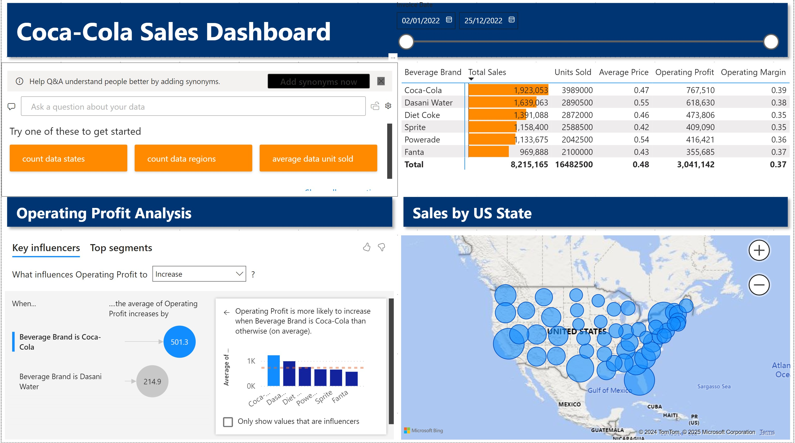
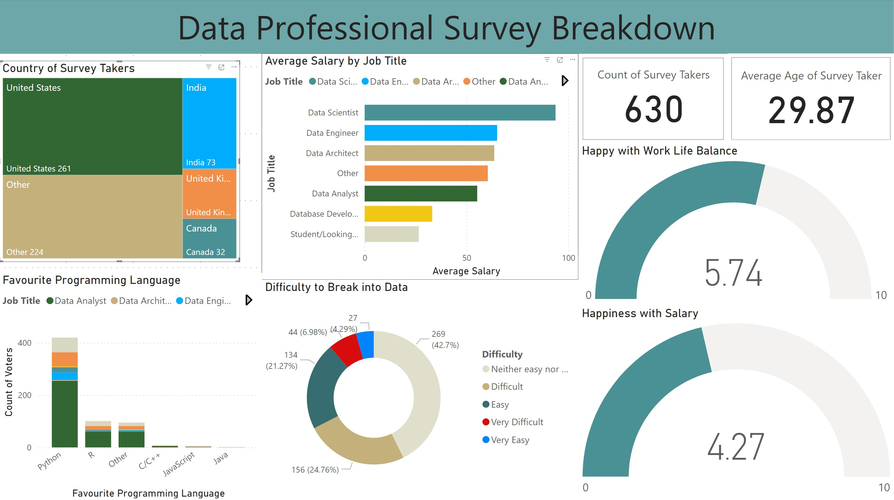
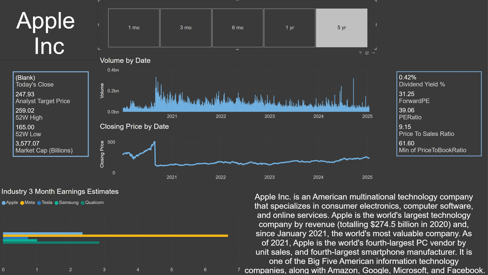

# Introducation

This project demonstrates how to build dynamic dashboards using PowerBI to analyze large datasets and support a business's decision making. The implementation of these dashboards leveraged tools such as PowerQuery to perform data transformation as a part of ETL operations and DAX to create dashboard measures. 3 dashboards were made using API's or excel files as data sources.   

## [Beverages Dashboard] (./beverage_dashboard/Coca-Cola_Sales_Dashboard.pbix)

This dashboard summarizes the sales of beverage brands under Coca-Cola for the 2022 fiscal period. Financial data was collected in an excel workboard and loaded into PowerBI using PowerQuery to convert datatypes and add measures. 

Overall, the top performing brand in terms of 2022 sales was Coca-Cola. This brand had the highest units sold to go along with the highest operating margin. All 6 brands were profitable however Fanta was the only brand with less than a million in sales. The states where the most sales occured were New York, California, Florida, and Texas. 

For future improvements, I would want to collect Pepsi/other competitors brands to compare which brands are outperforming their comparable brands. 

## [Data Professionals Survey](./data_report/Data_Survey_Report.pbix)

This dashboard summarizes the results from a research survey conducted on 630 data professionals regarding their profession's requirements and demographics. Survey results was stored in an excel workbook which was then imported into PowerBI using PowerQuery to format and create data. 

Overall, out of the 630 survey takers the country with the most demand for data professionals would be the United States with more than half of all professionals saying they work in the states. The top job in this industry belongs to Data scientists and data engineers. 

For future improvements, I would like to incorporate salary data to better understand metrics such as happiness with salary and compare role wages in the industry. 

## [Apple Stock Dashboard](./stock_dashboard/Apple_Stock_Dashboard.pbix)

This dashboard summarizes financial data for the Apple stock to evaluate it's performance compared to a selection of other competitors in the industry. Using an M query through PowerQuery, data was collected from 3 AlphaVantage API endpoints. PowerQuery functions were used to convert data provided in JSON into readable datatables for data visualization. 

Stock specific data was collected from the Time Series Daily and Company Overview API endpoints. This data was used to generate the company descriptions, display current financial metrics, and stock prices/volume over time graphs. 

Industry data was collected from the Earnings Calendar endpoint. This data was used to generate the industry 3 month earnings comparison. 

Overall, the Apple stock can be seen a top performing stock in the industry with steady growth and remains on track to maintain it's status as the world's largest technology company (by revenue). 

For future improvements, I would like to create more pages that analyze more stocks in different industries. 