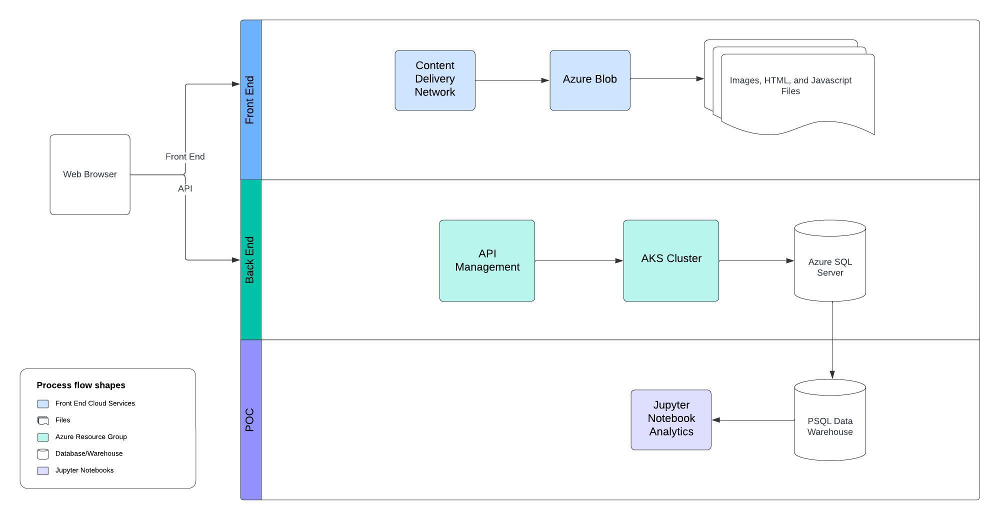

# Introduction
This proof of concept project helps demonstrate how to utilize data analytics tools to help an online gift shop (London Gift Shop) analyze their customer behaviour. The London Gift Shop (LGS) marketing team will use the analytics to develop targeted marketing strategies such as emails, events, targeted promotions, etc. The technologies used in this project included a data warehouse running on a docker container to store transaction data provided from the LGS team, Jupyter Notebooks to run Python code, and python libraries (pandas, numpy, matplotlib) to analyze transaction data.

# Implementaion
## Project Architecture
The LGS IT team manages a web application which has a front-end consisting of a content delivery network that manages images, HTML, and javascript files in an azure blob. The back end consists of APIs that perform microservices managing clusters of containers storing transactional data in an Azure SQL server database. 
The IT team provided a dataset of transactional data that could be loaded into a PostgreSQL after performing ETL processes such as removing customer information. Analytics was performed using python on a Jupyter Notebook. 

## Data Analytics and Wrangling

An analysis on the LGS transactions between 2009 and 2011 can be found at: [retail data analysis notebook][.\python_data_wrangling\retail_data_analytics_wrangling.ipynb] 

Using the monthly sales and orders diagrams, we can conclude that the holiday season is where LGS receives their highest sales as shown by the spikes in sales and placed orders around October and November. Due to the nature of a gift shops business, it will be significantly harder to reel in customers during non-holiday periods and developing a promotion during this time will not bring the best results. Knowing this information, the LGS marketing team can plan promotions to be best performing in implemented during the holiday season.  

A Recency, Frequency, and Monetary Value (RFM) table was prepared. Each customer was grouped into 5 quantiles for their respective RFM metrics. The combination of the recency and frequency scores rankings were used to create customer segments. The three segments chosen for further evaluation are the Need Attention (Medium recency and medium frequency), Hibernating (low recency and frequency), and Champions (high recency and frequency). 
The Need Attention segment are the people who fall in the middle in terms of how often they make purchases and how many orders they place. Amongst the 5942 customers, 273 customers fall into this category and will average between 17 and 18 purchases. 
The Hibernating segment consists of customers who dont purchase often or make many purchases in general. The segment consists of 1535 customers, and they have purchased between 1 and 2 times. These types of customers may come around for an annual gift purchase. 

The Champions segment consists of the top customers as they purchase the most frequent and are the most recent. This segment consists of 856 customers out of the total 5942 customers. An average customer makes around 7 purchases, while the average Champion customer makes 23 purchases. These customers would react most positively to being rewarded for their frequent purchases and could benefit from a potential loyalty/rewards program. 

LGS can create two separate strategies, consisting of a loyalty program to help keep Champions engaged and targeted promotions to help convert the Need Attention and Hibernating groups into more frequent customers. The targeted promotion will be most effective during the holiday season as the monthly sales/orders analysiss have shown these periods to have the highest activity whereas the loyalty program will help increase purchases throughout the year.  

# Improvements
Potential improvements for this project would include:
1.	Working with more current data as the dataset provide included only 3 years worth of transactions up to the end of 2011. Being able to analyze how the company performs with the introduction of more modern online retailers (i.e. Amazon) would have been beneficial.
2.	If given more time, I would have liked to collect more industry data to provide analysis comparing to the market and see what differences exist between competitors and LGS.
3.	Lastly, Id like to have gotten customer feedback to see what they want in terms of quality, pricing, and overall needs. This data could be used to help tailor the recommendations to make them more in line with what the current demands are from the LGS customers. 

